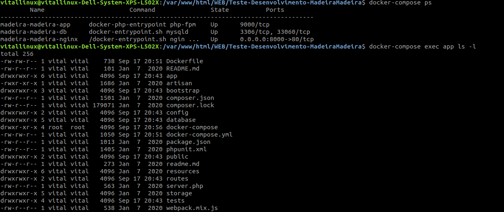

# Teste-Desenvolvimento-MadeiraMadeira

---
## Subindo o Docker para rodar o app
1. **docker-compose build app**
2. **docker-compose up -d**
3. 

---
## Instalar as dependências do composer
4. **docker-compose exec app composer install**
---

## crie uma chave para o artisan
5. **docker-compose exec app php artisan key:generate**